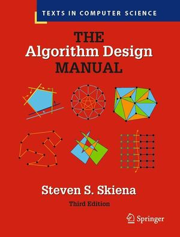

## Data Structures And Algorithms

ISBN-13 : 978-1849967204

Study followed 'The Algorithm Design Manual' by [Steven Skiena](https://www3.cs.stonybrook.edu/~skiena/).

### Study Program:
1. Understanding and recording notes for each chapter.
2. Watching associated lecture.
3. Writing practice examples in C where applicable.

Code can be compiled and run with the given Makefile.

Completed over the first half of 2025.
